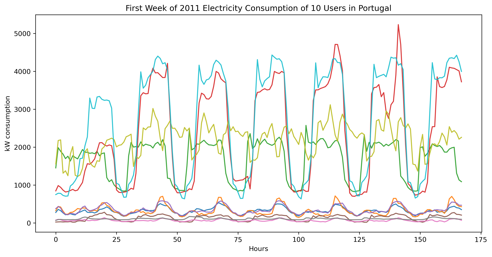
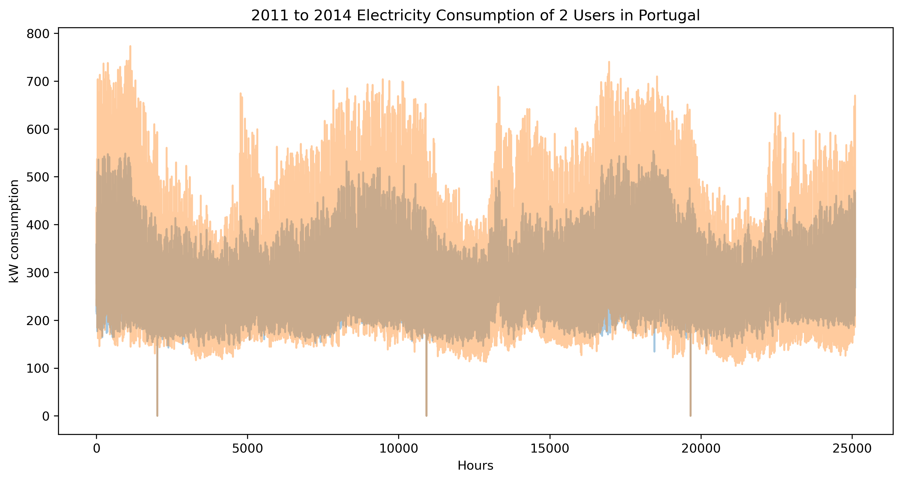
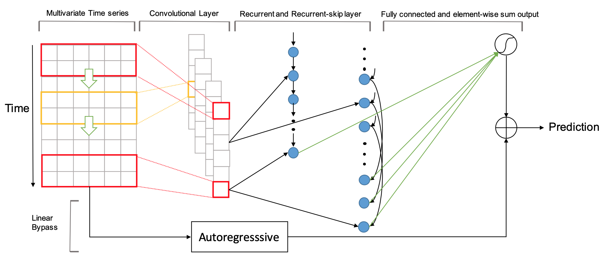
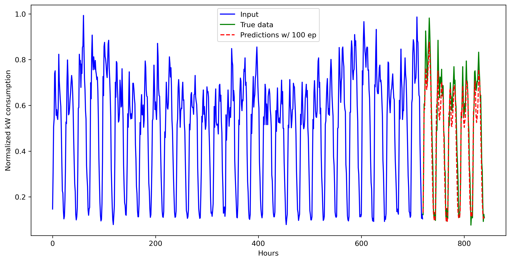
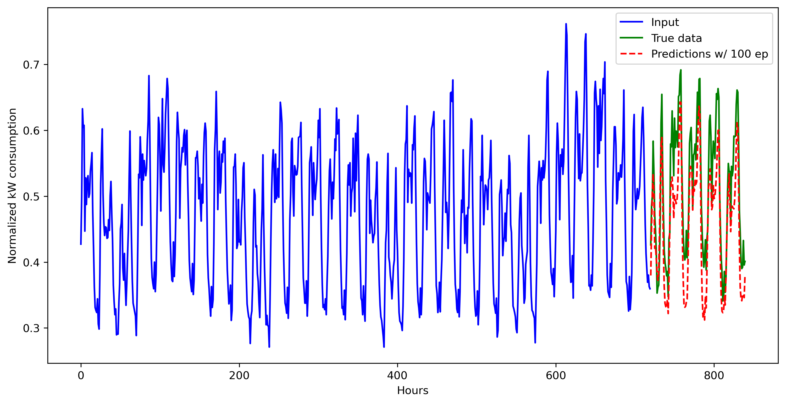
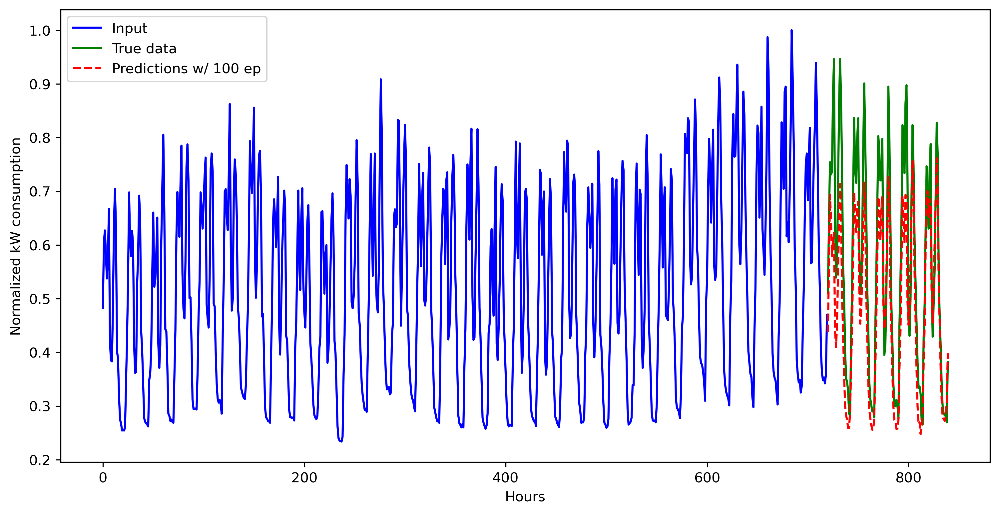
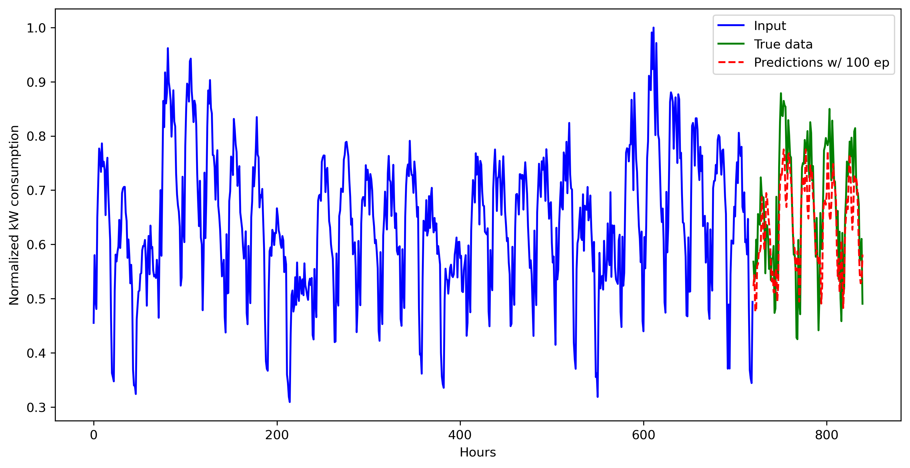

# Prédiction de la demande d'électricité au Portugal : une approche d'apprentissage
Simon Thérien - Mag Energy Solutions

## 1. Introduction
On cherche à prédire la demande d'électricité d'utilisateurs ménagers pour les 5 prochains jours (ou 120 prochaines heures) en prenant en entrée 720 heures d'utilisation. On dispose d'un [jeu de données](https://github.com/huggingface/datasets/tree/master/datasets/electricity_load_diagrams) composé de séries temporelles de consommation en kWh de 250 foyers portugais de 2011 à 2014. On fera appel à un modèle d'apprentissage automatique décrit dans l'article *Modeling Long- and Short-Term Temporal Patterns with Deep Neural Networks* que l'on décrira plus en détails dans les sections suivantes. À haut niveau, le modèle appelé LSTNet utilise une combinaison de réseaux de neurones récurrents (utilisés en analyse du langage) et de réseaux de neurones convolutifs (utilisés en imagerie par ordinateur) pour extraire des tendances à court terme (tendances quotidiennes) et à long terme (tendances saisonnières) présentes dans des données de consommation d'électricité.

## 2. Données
Avant de s'attaquer à l'apprentissage statistique, il est utile de visualiser les données. Comme mentionné précédemment, on remarque de la saisonalité à court terme (e.g. périodes quotidiennes de pointe) : 
et de la saisonalité à long terme (e.g. température au fil des saisons) : 
Pour ce qui suit, nous nous concentrons sur la tendance à court terme car nous cherchons à faire des prédictions à court terme.

## 3. Modélisation
### 3.1 Mise en contexte
Les réseaux de neurones profonds ont eu des impacts extraordinaires sur les solutions à un large éventail de problèmes. Les modèles de réseaux de neurones récurrents (RNN), par exemple, sont devenus les plus populaires dans les recherches récentes sur le traitement du langage naturel. Deux variantes de RNN en particulier, à savoir le Long Short Term Memory (LSTM) et le Gated Recurrent Unit (GRU) ont considérablement amélioré les performances en matière de traduction automatique, de reconnaissance vocale et de d'autres tâches de langage car ils capturent efficacement la signification des mots en fonction des dépendances à long terme et à court terme dans des contextes textuels. Dans le domaine de la vision par ordinateur, le réseau de neurones à convolution (CNN) a montré des performances exceptionnelles en extrayant avec succès des caractéristiques locales à partir d'exemples d'images (détection de cancers, etc.).

Dans le modèle proposé (LSTNet), on combine le CNN pour prédire les tendances à court terme et le RNN pour prédire les tendances à plus long terme.

### 3.2 Description
On peut visualiser l'architecture du modèle à l'aide du schéma suivant : 
1. La première couche convolutive cherche à extraire les tendances à court terme dans la dimension du temps ainsi que la dépendance locale entre les observations;
2. La sortie de la couche convolutive est simultanément utilisée comme entrée à la composante récurrente pour extraire la dépendance à plus long terme;
3. Finalement, on combine les données de manière linéaire (autorégression) afin de préserver l'aspect de taille des données.

### 3.3 Code (pour fins de complétude)
En Python, le modèle est défini comme suit :
```
class LSTNet(nn.Module):
    def __init__(self, data, window, n_feat, n_hid_rnn, n_hid_cnn, n_hid_skip, ker_height, skip_len, ar_window, dropout_prob, cuda=True):
        super(LSTNet, self).__init__()
        # input array with shape (n_samples, n_targets) where n_samples=L and n_targets=N
        self.use_cuda = cuda # False
        self.P = window # window size = 720 hours (or 25 days)
        self.m = n_feat  
        self.hidR = n_hid_rnn # nb hidden for RNN = 100
        self.hidC = n_hid_cnn # nb hidden for CNN = 100
        self.hidS = n_hid_skip # nb hidden skip = 5
        self.Ck = ker_height
        self.skip = int(skip_len)
        self.pt = int((self.P - self.Ck)/self.skip)
        self.hw = int(ar_window) 

        self.conv1 = nn.Conv2d(1, self.hidC, kernel_size = (self.Ck, self.m)) # in channels = 1, out channels = nb hidden CNN
        self.GRU1 = nn.GRU(self.hidC, self.hidR) # input shape = (L, N, H_in=hid CNN), h_0 = (1, N, H_out=hid RNN)
        self.dropout = nn.Dropout(p = dropout_prob) 
        if (self.skip > 0):
            self.GRUskip = nn.GRU(self.hidC, self.hidS)
            self.linear1 = nn.Linear(self.hidR + self.skip * self.hidS, self.m)
        else:
            self.linear1 = nn.Linear(self.hidR, self.m)
        if (self.hw > 0):
            self.highway = nn.Linear(self.hw, 1)
        self.output = None
 
    def forward(self, x):
        batch_size = x.size(0) # x shape = (N, nb features = nb users); N = 
        
        #CNN
        c = x.view(-1, 1, self.P, self.m) 
        c = F.relu(self.conv1(c))        
        c = self.dropout(c)
        c = torch.squeeze(c, 3)           
        # RNN 
        r = c.permute(2, 0, 1).contiguous()
        _, r = self.GRU1(r)
        r = self.dropout(torch.squeeze(r,0))


        # Recurrent-skip component
        if (self.skip > 0):
            s = c[:,:, int(-self.pt * self.skip):].contiguous()       
            s = s.view(batch_size, self.hidC, self.pt, self.skip)     
            s = s.permute(2,0,3,1).contiguous()                       
            s = s.view(self.pt, batch_size * self.skip, self.hidC)    

            # Each sequence time step now is one day (24 hours) instead of one hour, between each time stamp. 
            # Meaning this configuration would try to predict a day forward.
            # output=(1, N*24, hidS)
            _, s = self.GRUskip(s)
            s = s.view(batch_size, self.skip * self.hidS)             # Reshapes back to batches of N (one hour) format, output= (N, 24*hidS)
            s = self.dropout(s)
            r = torch.cat((r,s),1)
        
        res = self.linear1(r) # (N, nb_feat)
        
        # Autoregressive component self.hw = nb of AR lags
        if (self.hw > 0):
            z = x[:, -self.hw:, :]                                  
            z = z.permute(0,2,1).contiguous().view(-1, self.hw)    
            z = self.highway(z)                                     
            z = z.view(-1, self.m)                                  
            # final output is Y = Y_rnn_skip + Y_ar = res + z
            res = res + z

        return res
```
l'optimiseur :
```
class Optimize():
    def _makeOptimizer(self):
        self.optimizer = torch.optim.Adam(self.params, lr=self.lr)

    def __init__(self, params, lr, max_grad_norm):
        self.params = list(params)  # careful: params may be a generator
        self.lr = lr
        self.max_grad_norm = max_grad_norm
        self._makeOptimizer()

    def step(self):
        # Compute gradient norm
        grad_norm = 0
        for param in self.params:
            grad_norm += param.grad.data.norm()**2

        grad_norm =np.sqrt(grad_norm)
        if grad_norm > 0:
            shrinkage = self.max_grad_norm / grad_norm
        else:
            shrinkage = 1.

        for param in self.params:
            if shrinkage < 1:
                param.grad.data.mul_(shrinkage)

        self.optimizer.step()
        return grad_norm
```
et finalement la procédure d'entraînement :
```
def train(data_util, X, Y, model, criterion, optim, batch_size):
    model.train()
    total_loss = 0
    n_samples = 0
    for X, Y in data_util.get_batches(X, Y, batch_size, True):
        model.zero_grad()
        output = model(X)
        scale = data_util.scale.expand(output.size(0), data_util.m)
        loss = criterion(output * scale, Y * scale)
        loss.backward()
        grad_norm = optim.step()
        total_loss += loss.data.item()
        n_samples += (output.size(0) * data_util.m)
    return total_loss / n_samples
```
Nous sommes maintenant équipés pour entraîner le modèle et faire des prédictions sur un sous-ensemble des données.
## 4. Résultats
Après avoir entraîné le modèle partiellement (accès limité à des puissances de calcul), on remarque des résultats prometteurs sur les dernières données de la série. On peut visualiser les prédictions sur certains utilisateurs pour s'en assurer (avec des données normalisées pour faciliter l'entraînement du modèle). Les données en entrée sont bleues, les vraies données en vert et les prédictions en rouge :








## 5. Conclusion et pistes d'améliorations
Nous avons présenté un cadre d'apprentissage profond (LSTNet) pour la tâche de prédiction de séries chronologiques multivariées. À la lumière des résultats, nous pouvons conclure que des techniques d'apprentissage automatique peuvent bien prédire des données qui présentent des tendances, comme dans notre cas sur des données de demande d'électricité. En terminant, nous énumérons des points d'amélioration :
1. Modifier le code pour utilisation sur GPU (accélération du processus : pour arriver aux résultats précédents le modèle a été entraîné pendant 6 heures);
2. Optimiser les hyperparamètres du modèle;
3. Inclure une procédure pour prédire sur des données jamais vues par le modèle (contrairement à la validation croisée que nous avons fait);
4. Adapter le code pour faire des prédictions à long terme.

